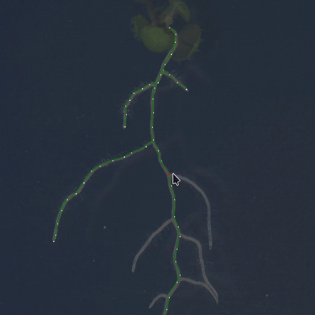
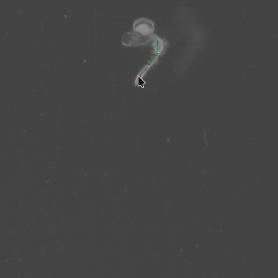

# [name pending]
🌱 This is a small software package for analyzing images of _Arabidopsis thaliana_ roots.

📷 It features a GUI for semi-automated image segmentation

⏰ with support for time-series GIFs

☠️ that creates dynamic 2D skeleton graphs of the root system architecture (RSA).

🔍 It's designed specifically to handle complex, messy, and highly-branched root systems well — the same situations in which current methods fail.

📊 It also includes some (very cool) algorithms for analyzing those skeletons, which were mostly developed by other (very cool) people[1](#f1),[2](#f2). The focus is on measuring cost-performance trade-offs and Pareto optimality in RSA networks.

⚠️ This is very much a work-in-progress! These are custom scripts written for a small, ongoing research project — so I can't offer any support or documentation yet. 

🔨 That said, if you're interested in tinkering with the code, enjoy! And please reach out with comments, ideas, suggestions, or feedback. 

## References
<b id="f1">1.</b> Chandrasekhar, Arjun, and Navlakha, Saket. "Neural arbors are Pareto optimal." _Proceedings of the Royal Society B_ 286.1902 (2019): 20182727. https://doi.org/10.1098/rspb.2018.2727 [↩](#a1)

<b id="f2">2.</b> Conn, Adam, et al. "High-resolution laser scanning reveals plant architectures that reflect universal network design principles." _Cell Systems_ 5.1 (2017): 53-62. https://doi.org/10.1016/j.cels.2017.06.017 [↩](#a2)

### Acknowledgments
Matt (for guidance, ideas, and support); Illia (for technical advice); Tosh (for help debugging, and friendship)
